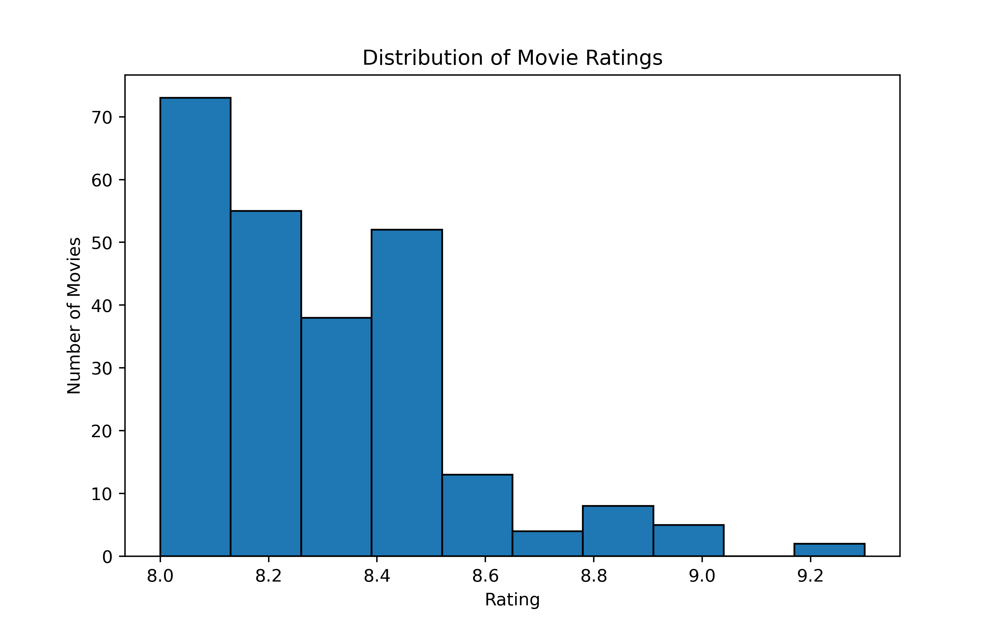
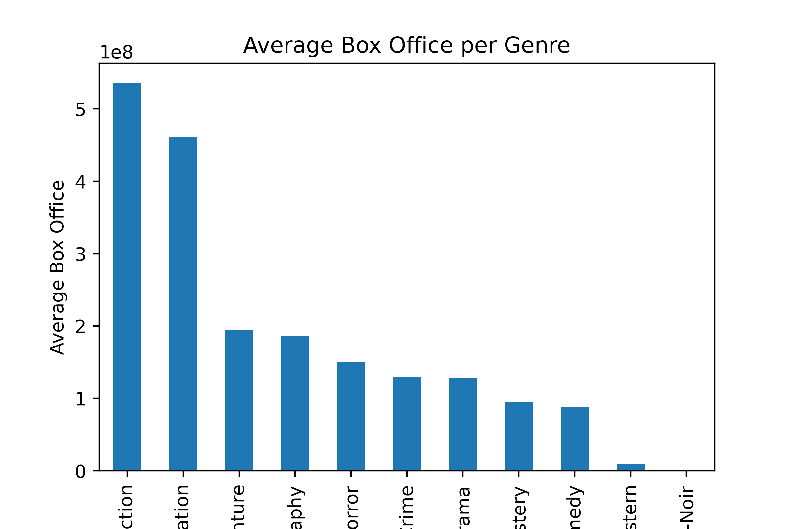
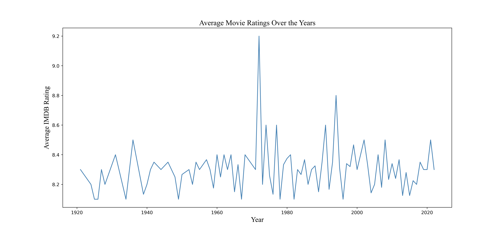

# IMDb Top 250 Movies Data Analysis

## Overview

This project was completed as part of a university Data Science course in collaboration with my teammates **Buthaina Mohammed** and **Layan Alharthi**.

The objective of this project was to analyze the IMDb Top 250 Movies dataset using Python to uncover insights into movie ratings, genres, release years, and box office performance through data cleaning, exploratory data analysis (EDA), and visualization.

## Objectives

- Clean and preprocess the dataset.
- Handle missing values.
- Perform Exploratory Data Analysis (EDA).
- Visualize trends and patterns.
- Generate meaningful insights from the data.

## Tools & Technologies

- Python
- Pandas
- Matplotlib

## Dataset

**Dataset:** IMDb Top 250 Movies Dataset

**Source:** Kaggle

https://www.kaggle.com/datasets/rajugc/imdb-top-250-movies-dataset

## Visualizations

### Movie Ratings Distribution


### Box Office Performance by Genre


### Average Rating Over Years


## Key Findings

- Most IMDb Top 250 movies have ratings between **8.0 and 8.5**, while ratings above **9.0** are rare.
- Action and Animation genres have the highest average box office performance.
- Western and Film-Noir genres have the lowest average box office revenue.
- Average movie ratings fluctuate over the years with no clear long-term trend.
- The dataset required preprocessing to handle missing values and inconsistent formatting before analysis.

## Project Files

- **Source Code:** [imdb_top250_analysis.py](src/imdb_top250_analysis.py)
- **Final Report:** [Group#1_Report_Project.pdf](report/Group#1_Report_Project.pdf)

## How to Run

1. Clone or download this repository.
2. Install the required libraries:

```bash
pip install pandas matplotlib
```

3. Open the `src` folder.
4. Run:

```bash
python imdb_top250_analysis.py
```

5. The script will perform data cleaning, exploratory data analysis (EDA), and generate the visualizations included in this repository.
   
## Team Members

- Layan Alazwari
- Buthaina Mohammed
- Layan Alharthi
